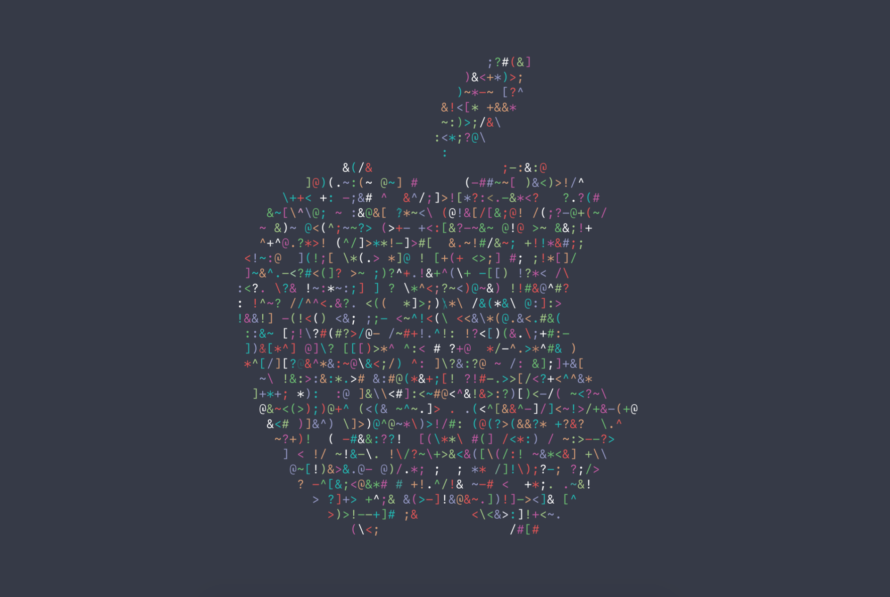

# WWDC 2016 screensaver

## What's this?
Apple created an awesome intro clip to the [WWDC 2016 session videos](https://developer.apple.com/videos/wwdc2016/) that looks like this:    
    

This screensaver replicates that behavior, including the Apple icon shape, the [SF Mono](http://daringfireball.net/linked/2016/04/20/san-fran-mono) font and the WWDC 2016 colors.

## Instalation
1. Download most recent release [here](https://github.com/justMaku/wwdc2016screensaver/releases/latest)
2. Unzip the archive
3. Double-click the `WWDC 2016 ScreenSaver.saver` file.

## Building
This screensave has been written in Swift 3.0 and requires XCode 8 to compile.

## Troubleshooting
If System Preferences tells you to ask for a newer version, go to  ~/Library/Preferences/ByHost  and delete all files starting with  com.apple.screensaver  then reboot. (from [here](https://whichline.wordpress.com/2015/07/13/os-x-screensaver-swift-2-part-1/))
