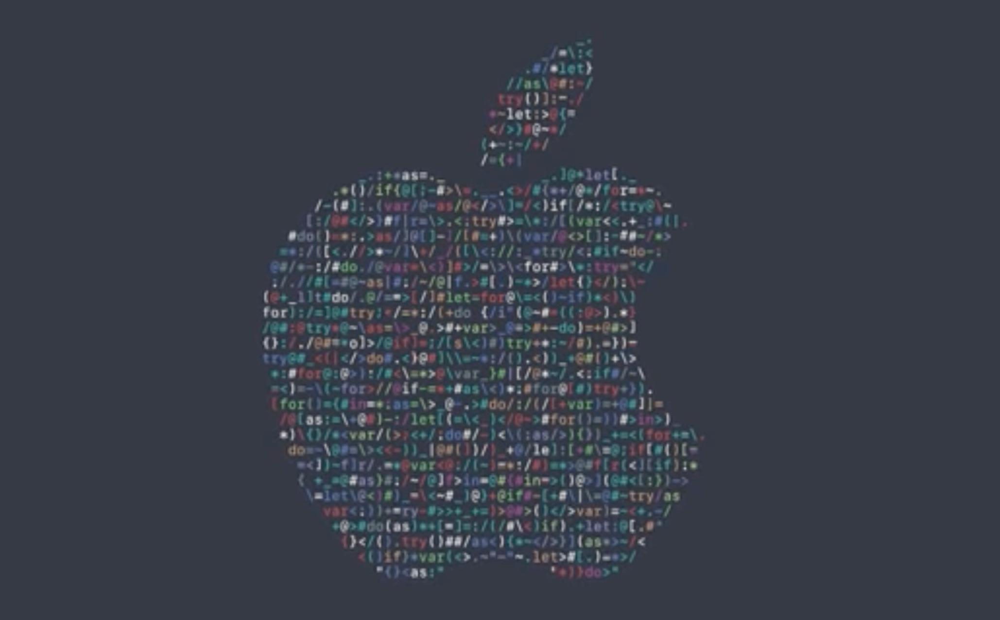

# WWDC 2016 screensaver

## What's this?
Apple created an awesome intro clip to the [WWDC 2016 session videos](https://developer.apple.com/videos/wwdc2016/) that looks like this:    
    

This screensaver replicates that behavior, including the Apple icon shape, the [SF Mono](http://daringfireball.net/linked/2016/04/20/san-fran-mono) font and the WWDC 2016 colors.
